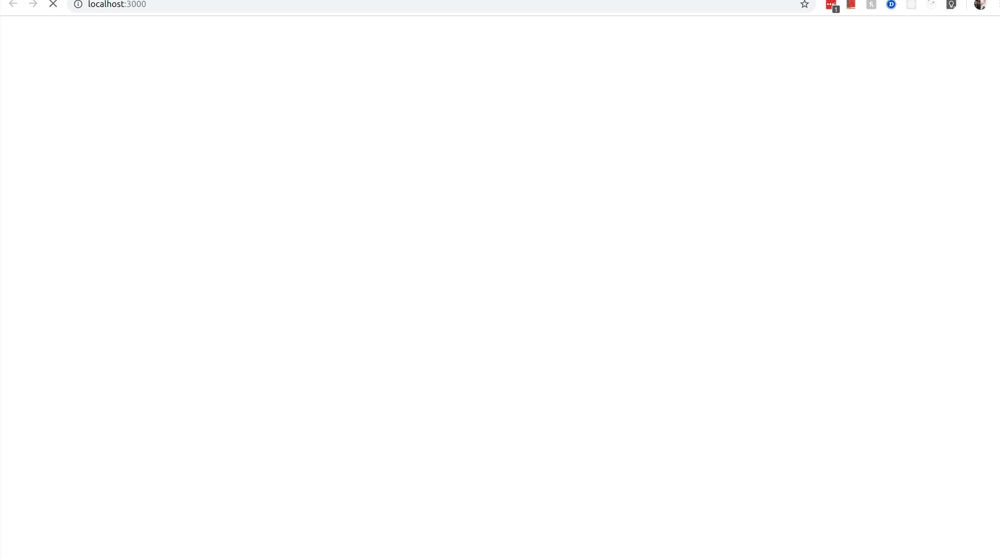

# GDP-Growth-of-USA



#### A graph in motion for visualizing the growth of the gross domestic product of US for last 60 years. 
#### Built using d3, React and Express-Node.

#### Installation
Clone the repository in any new directory, cd into it.
```sh
git clone https://github.com/hrishiwaikar/GDP-Growth-of-USA.git
```
You will see a directory named "GDP-Growth-of-USA";
cd into it and on doing "ls" you'll see directories backend and gdp_frontend.
Inside backend directory, install dependencies and start the server. The server runs on port 5000.
```sh
cd backend
npm install
node server
```

Similarly in another terminal, go into gdp_frontend dir and install dependencies.
Start the front end server too.
```
cd gdp_frontend
npm install
npm start
```

A window/tab should open in chrome or other browser with url http://localhost:3000/ and you should see the graph just as shown in the above gify.


HRISHIKESH WAIKAR
SJSU ID: 013836693 
hrishikesh.waikar@sjsu.edu
